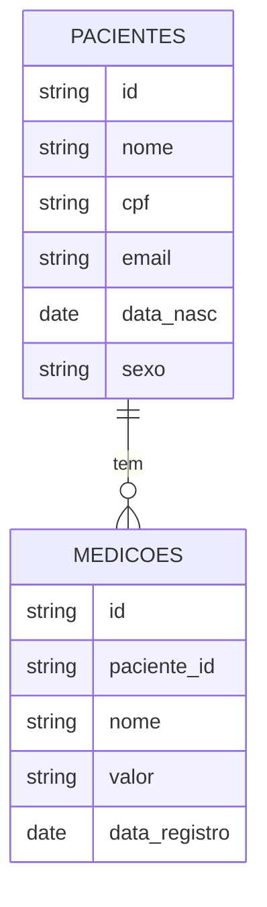
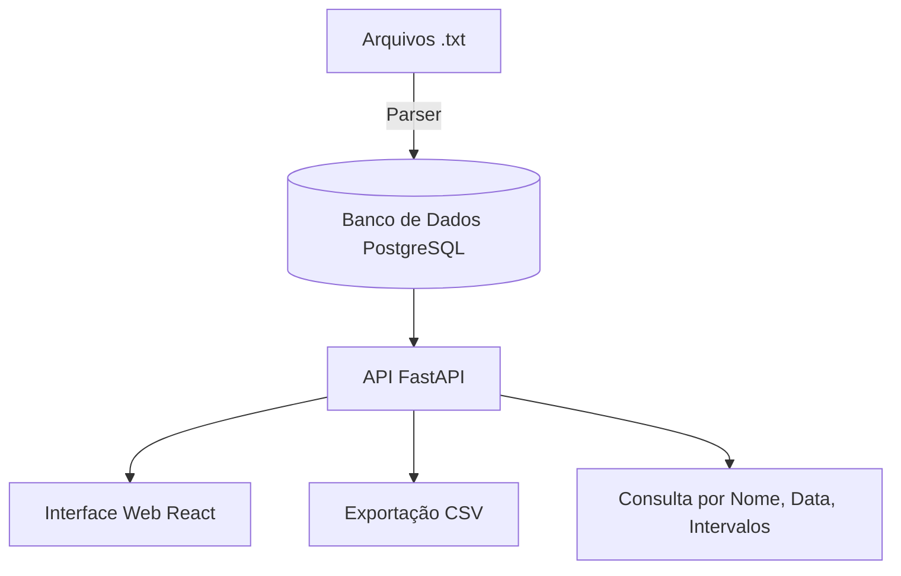

# 🏥 Anlix Hospital Data API

API RESTful e Interface Web para consulta de características de pacientes terminais internados em hospital, conforme o desafio proposto pela Anlix.

## 🚀 Tecnologias Utilizadas

- **Backend**: Python 3.10+, FastAPI
- **Frontend**: HTML, JavaScript, Vue Js
- **Banco de Dados**: PostgreSQL
- **ORM**: SQLAlchemy
- **Exportação CSV**: Pandas
- **Gráficos**: Chart.js via frontend
- **Containerização**: Docker

---

## 📁 Estrutura do Projeto

```bash
anlix-hospital-api/
├── backend/
│   ├── dados/  
│   ├── import_data.py 
│   ├── main.py               
│   ├── models.py             
│   ├── properties.py           
│   ├── requirements.txt
├── frontend/
│   ├── vue-anlix/
│       ├── src/
│           ├── components/
│               ├── CaracteristicasResumo.vue
│               ├── GraficoTemporal.vue
│               ├── PacienteBusca.vue
│       ├── main.js
│       ├── App.vue
│       ├── index.html
├── docker-compose.yml
├── Dockerfile
└── README.md
```

---

## 🧠 Modelo de Dados



---

## 🌐 Arquitetura da Solução



---

## 📦 Como Executar o Projeto 

> Requer: [Docker](https://www.docker.com/) instalado

### 1. Clone o repositório

```bash
git clone https://github.com/seu-usuario/anlix-hospital-api.git
cd anlix-hospital-api
```

### 2. Inicie o ambiente com Docker Compose

```bash
docker-compose up --build
```

A aplicação estará disponível em:

- **API**: [https://desafio-anlix-api.up.railway.app/docs](https://desafio-anlix-api.up.railway.app/docs) (Swagger)
- **Frontend**: [https://desafio-anlix.netlify.app/](https://desafio-anlix.netlify.app/)

---

## 📌 Funcionalidades da API

### 🔍 Paciente

- Buscar paciente por nome (parcial ou completo)
- Obter as **últimas características** de um paciente
- Obter todas as características de um paciente para uma **data específica**
- Obter uma característica em **intervalo de datas**
- Obter as características em **intervalo de datas e do tipo de caracteristica**
- Buscar pacientes cujo valor de uma característica está em um **intervalo numérico**

---

## 🖥 Funcionalidades da Interface Web

- 🔎 Buscar paciente por nome
- 📊 Exibir gráfico de evolução de uma característica
- 📄 Exportar características de um ou mais pacientes em CSV

---

## 📂 Importação dos Arquivos

Crie ou mova os arquivos `.txt` para o diretório `/dados` e a aplicação os processará ao subir.
